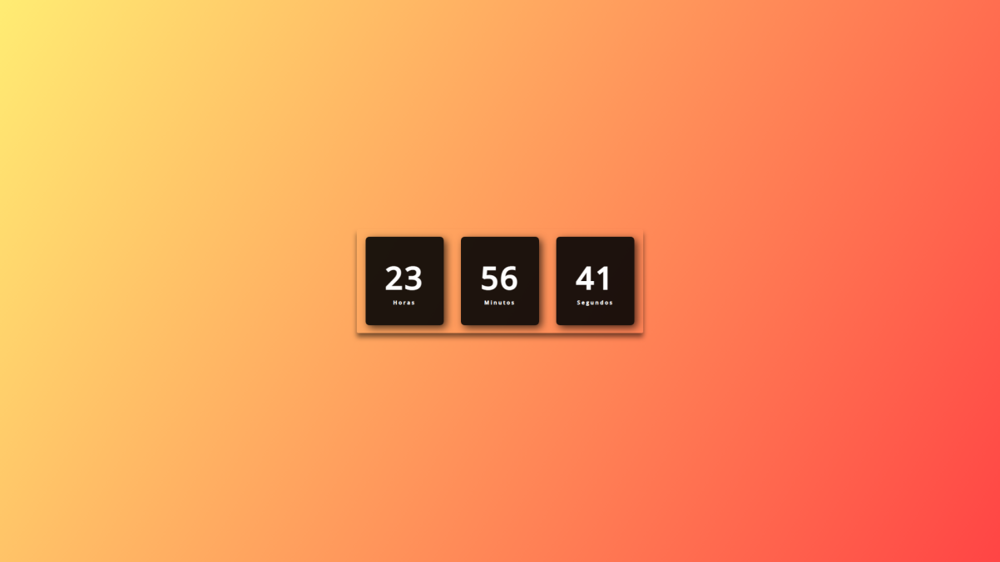

<h1 align="center"> Relógio Digital DINÂMICO </h1>

Praticando HTML, CSS e JAVASCRIPT com o canal do Youtube da <a href="https://www.youtube.com/@larissakich">Larissa Kich.</a>  
<a href="https://www.youtube.com/watch?v=GK0ok3ZCXwM&t=1s&ab_channel=LarissaKich">Estude esse projeto em formato de vídeo clicando aqui.</a>

  

## 🚀 Tecnologias

Esse projeto foi desenvolvido com as seguintes tecnologias:

- HTML e CSS
- JavaScript
- Git e Github

## 💻 Projeto

É um relógio digital dinâmico com HTML, CSS e JAVASCRIPT, de forma rápida e prática.

- [Acesse o projeto finalizado, online](https://feliperittes.github.io/dynamic-digital-clock/)

- [Assistir tutorial](https://www.youtube.com/watch?v=GK0ok3ZCXwM&t=1s&ab_channel=LarissaKich)

---

Feito com ♥ by [Larissa Kich](https://github.com/Larissakich)
